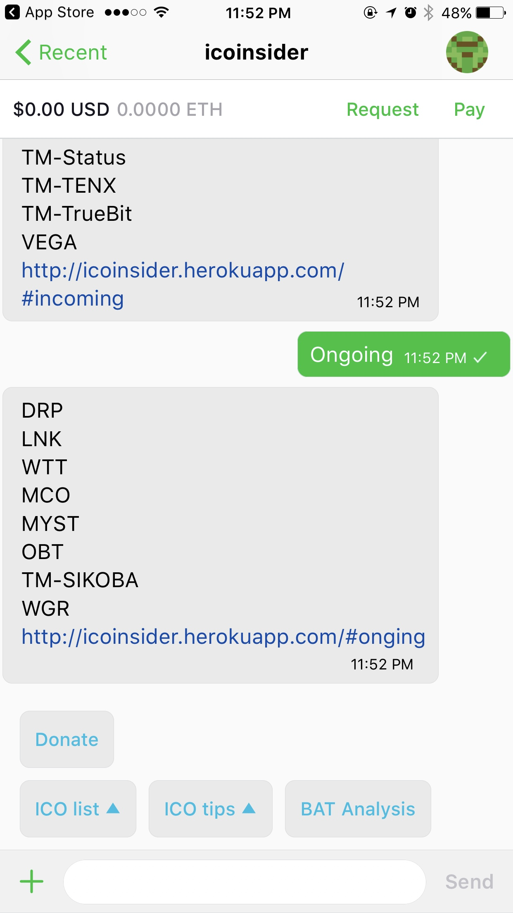
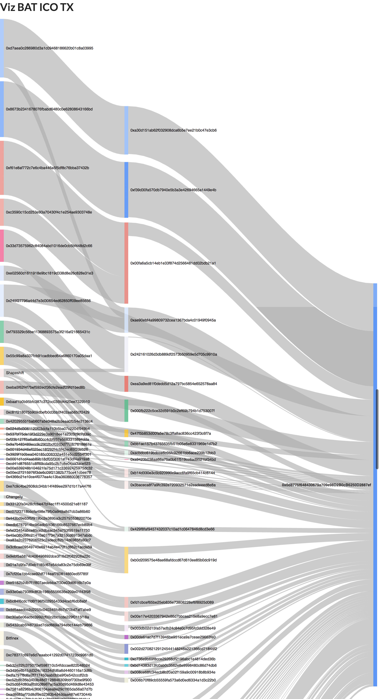

# ICO Helper for Token Hackathon

## Feature:
- ICO bot `icoinsider` in Token app.
- Crawlers of ICO tokens and deep transactions.
- ETH cash flow data-viz PoC with BAT ICO data.

Bot                        |  BAT ICO Cash Flow
:-------------------------:|:-------------------------:
  |  

## Future Work
- Crawler Pipeline
- Other data-viz

## Running locally

#### Prepare:
- Install and run docker
- `yarn`
- `cd src/client && yarn`
- Amend `docker-compose-dev.yml` with your own TOKEN_APP_SEED, generate it [here](https://www.tokenbrowser.com/token-seed-generator/) and update your own app name and user name, make sure no others using it.

#### Start Dev:
- `yarn bot: up docker for local bot dev`
- `yarn web: Express backend at http://localhost:3001 and React frontend at http://localhost:3000`

#### After Dev:
To reset the postgres database for bot:
```
yarn reset
```
Build web-client before push:
```
cd src/client && yarn build
```
Test web after build:
```
yarn prod
```

## Data Viz

Researches:
- [Sankey Diagrams](https://bost.ocks.org/mike/sankey/)
- [Weighted Tree](http://vizuly.io/product/weighted-tree/?demo=d3js)
- [Sequences sunburst](https://bl.ocks.org/kerryrodden/7090426)

## Architecture

#### Bot:
* **token-headless-client**<br>
  This is a client we provide (similar to the iOS or Android client) that provides a wrapper around the Token backend services. It also handles end-to-end encrypting all messages using the Signal protocol. It is written in Java and runs in the background, proxying all the requests to amd from your bot.
* **redis**<br>
  We use redis pub/sub to provide a connection between the token-headless-client and your bot.
* **bot.js**<br>
  This is where all your app logic lives.
* **postgres**<br>
  Postgres is used to store session data so you can persist state for each user who talks to your bot (similar to cookies in a web browser).


##### Web:
* **Node & Express as static files / API server**<br>
* **React stack frontend**<br>


## Contributors
By alphabetical order:
- [@foreseaz](https://github.com/foreseaz)
- [@lambda](https://github.com/zeqing-guo)
- [@liss](https://github.com/edithli)

## License
MIT
